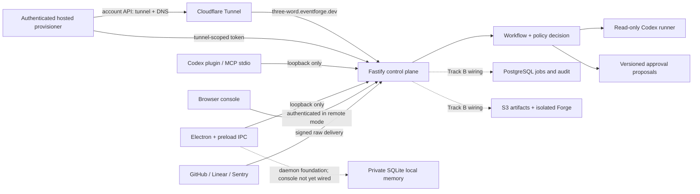

# Architecture

## Runtime boundaries

Local mode is the supported runnable mode. The API binds to loopback, local MCP
uses stdio without credentials, and the standalone package/plugin can embed that
API automatically. The loopback HTTP MCP launcher is available for clients that
cannot use stdio. Electron exposes a narrow preload bridge, and consequential
proposals require a separate decision. See [CONFIGURATION.md](CONFIGURATION.md)
for the supported launch modes and environment contract.

Remote mode is intentionally fail-closed. Startup requires PostgreSQL, an encryption key, explicit browser origins, and an injected MFA-authenticated identity provider. The repository contains durable PostgreSQL schema and queue primitives, but the normal entry point does not enable remote mode until authentication and complete repository hydration are wired.

## Hosted identity boundary

Issue #7 introduces a separate hosted identity service at the same browser origin,
`https://eventforge.dev/api/auth`. D1 is the relational source of truth for users,
verified email challenges, workspaces, memberships, invitations, factors, and
governance audit records. It does not authorize a request by itself. Every hosted
request must first validate its opaque session identifier against a per-user,
SQLite-backed Durable Object. That object is the strongly consistent authority
for active sessions and revocation epochs; an unavailable authority denies access.
There is exactly one object per canonical user identifier, selected with a
deterministic object name. It contains every session for that user and is never
split by workspace, device, or region, so a single epoch change invalidates all
affected sessions without cross-shard propagation.
The Fastify control plane receives only the resulting current identity,
workspace membership, role, scopes, session identifier, and MFA time through its
existing injected authenticator boundary.

The hosted implementation uses Better Auth's D1-compatible database support,
email verification, organization access control, TOTP, and WebAuthn passkey
support. EventForge owns the stricter policy layer: public registration is off,
roles map to EventForge permissions, privileged operations require an absolute
15-minute MFA window, and recovery codes use one-way salted hashes rather than a
later-viewable encrypted backup-code store.

WebAuthn uses RP ID `eventforge.dev` and production origin
`https://eventforge.dev`. Enrollment requires a verified session, user
verification, and resident credentials for Owner and Admin factors. Lower roles
may use a resident-preferred credential for sign-in. The server validates the
challenge, origin, RP ID, credential/account binding, and signature counter, and
records credential properties, backup state, and AAGUID. Unsupported required
capabilities fail explicitly.

Email verification proves control of one normalized address through a
single-use one-hour challenge; it does not prove employment or domain ownership.
Invitations use opaque random identifiers, expire after seven days, and can be
accepted only by a verified session for the exact invited address. Ownership
changes and account closure are serialized with optimistic versions and storage
transactions. The last owner cannot leave, be removed, be downgraded, or close
their account. There is no support impersonation or factor bypass.

Membership removal and downgrade use a revoke-first transition. The user object
first blocks new sessions and increments its revocation epoch, D1 then commits the
membership version, and only then may the object allow sessions with the new
version. Failure after the first step leaves the user blocked rather than
over-authorized. Success is not returned until both stores commit.

Revocation is defined at that authority commit boundary: every new request after
the commit is denied; already-running requests are not retroactively cancelled.
The end-to-end SLO from accepting an authorized revocation request to that commit
remains 60 seconds. A breach alerts operations and is not hidden by a cache or
eventually consistent token. Because all hosted requests consult the authority,
an authority outage fails closed for reads as well as writes.

P0 deliberately has no artificial keepalive. Normal traffic keeps active user
objects warm; cold starts are accepted and measured rather than multiplying cost
and load with scheduled pings. The release gate measures warm and cold p95/p99
session-validation latency. Added validation latency must remain at or below 100
ms warm p95, 200 ms warm p99, 250 ms cold p95, and 500 ms cold p99 in the launch
regions. A per-user object accepts at most 100 validations per second with a
bounded burst of 200; excess traffic fails explicitly instead of growing an
unbounded queue.

The authority stores only sessions, request tokens, revocation epochs, and
transition state in SQLite-backed Durable Object storage. Identity factors and
workspace membership remain in D1, so authority recovery cannot manufacture an
identity or grant access. Storage invariants and schema versions are checked on
every object start. An invariant or storage failure quarantines the object and
denies every session.

SQLite point-in-time recovery is retained for 30 days as the operational backup
mechanism. Restore is performed with ingress disabled for the affected authority.
Before ingress resumes, the recovery procedure atomically increments the
revocation epoch, deletes all restored sessions and request tokens, clears any
partial transition, and records the incident in D1. All users then authenticate
again with their independently stored verified factor or recovery code. Active
session material is never exported to a second backup. If storage cannot be
restored, the same fail-closed reset creates an empty authority; it cannot restore
or bypass a lost identity factor.

## Trust boundaries

- Provider bodies are untrusted until provider-specific raw-body signature, delivery identifier, and replay checks where supported succeed. Remote installation scope is resolved separately through configured mappings.
- Workspace and project scope comes from configured integration mappings in remote mode, never webhook-supplied workspace fields.
- Policy is evaluated at proposal creation and again at approval. The evaluator constrains role, provider, repository, path, domain, capability, approval mode, and policy version; current generated proposals do not yet derive exact changed paths.
- Codex analysis is read-only. Approval changes proposal state; it does not execute or hot-load code.
- Forge Studio currently creates and statically scans a reviewable draft. Disposable sandboxes, immutable artifact storage, and out-of-process connector execution are Track B work.
- Managed tunnel names are deterministic pseudorandom three-word slugs derived from the authenticated actor/workspace and a server-only HMAC key. The hosted provisioner owns Cloudflare account credentials; local EventForge receives only the tunnel-scoped run token and launches `cloudflared` with a protected token file. Cloudflare ingress and the loopback router expose only `/health` and exact signed-provider webhook paths through the public hostname. The public provisioning route remains disabled until remote owner authentication and Cloudflare account/zone secrets are configured.

## Stable contracts

The runtime contracts live in `packages/core/src/contracts.ts`: `RuntimeMode`, `AuthContext`, `ProviderAdapter`, `PolicyDecision`, `EventEnvelope`, `WorkflowDefinition`, `ActionProposal`, `ForgeJob`, repository interfaces, and MCP scopes.
