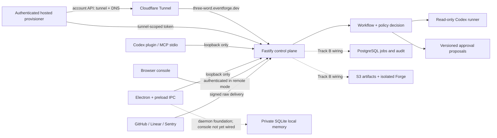

# Architecture

## Runtime boundaries

Local mode is the supported runnable mode. The API binds to loopback, local MCP
uses stdio without credentials, and the standalone package/plugin can embed that
API automatically. The loopback HTTP MCP launcher is available for clients that
cannot use stdio. Electron exposes a narrow preload bridge, and consequential
proposals require a separate decision. See [CONFIGURATION.md](CONFIGURATION.md)
for the supported launch modes and environment contract.

Remote mode is intentionally fail-closed. Startup requires PostgreSQL, an encryption key, explicit browser origins, and an injected MFA-authenticated identity provider. The repository contains durable PostgreSQL schema and queue primitives, but the normal entry point does not enable remote mode until authentication and complete repository hydration are wired.

## Trust boundaries

- Provider bodies are untrusted until provider-specific raw-body signature, delivery identifier, and replay checks where supported succeed. Remote installation scope is resolved separately through configured mappings.
- Workspace and project scope comes from configured integration mappings in remote mode, never webhook-supplied workspace fields.
- Policy is evaluated at proposal creation and again at approval. The evaluator constrains role, provider, repository, path, domain, capability, approval mode, and policy version; current generated proposals do not yet derive exact changed paths.
- Codex analysis is read-only. Approval changes proposal state; it does not execute or hot-load code.
- Forge Studio currently creates and statically scans a reviewable draft. Disposable sandboxes, immutable artifact storage, and out-of-process connector execution are Track B work.
- Managed tunnel names are deterministic pseudorandom three-word slugs derived from the authenticated actor/workspace and a server-only HMAC key. The hosted provisioner owns Cloudflare account credentials; local EventForge receives only the tunnel-scoped run token and launches `cloudflared` with a protected token file. Cloudflare ingress and the loopback router expose only `/health` and exact signed-provider webhook paths through the public hostname. The public provisioning route remains disabled until remote owner authentication and Cloudflare account/zone secrets are configured.

## Stable contracts

The runtime contracts live in `packages/core/src/contracts.ts`: `RuntimeMode`, `AuthContext`, `ProviderAdapter`, `PolicyDecision`, `EventEnvelope`, `WorkflowDefinition`, `ActionProposal`, `ForgeJob`, repository interfaces, and MCP scopes.

## SDK and marketplace foundation (issue #14)

`@eventforge/core/sdk` is the public v1 connector boundary. It accepts only
`source.ingest.v1`, `context.read.v1`, and `notification.send.v1`; it does not
grant raw host, environment, filesystem, shell, arbitrary HTTP, admin, deploy,
or self-modifying access. Implementations receive tenant-bound contexts with a
deadline, idempotency key, abort signal, and capability logger, and return
typed outcomes rather than secrets or host errors.

Installation is fail-closed until issue #8 artifact trust is available. A
reviewed, unexpired publisher review, exact-digest Owner recent-MFA approval,
valid signature, non-revoked artifact, and compatible core/capability set are
all required. Marketplace listings are not authority: during an outage only an
existing exact installation with a valid signed revocation snapshot no older
than 15 minutes may run. Full production certification remains closed pending
the real signer/revocation services and recovery drills.
